# Pangaea Developer's Guide
- [Pangaea Developer's Guide](#pangaea-developers-guide)
  - [Introduction](#introduction)
  - [Concept](#concept)
  - [What exactly can it do?](#what-exactly-can-it-do)
  - [Pangaea Specification](#pangaea-specification)
  - [Examples of what you can do](#examples-of-what-you-can-do)
  - [Example 1: Create a Thumb module with 4 keys instead of the standard 5 keys](#example-1-create-a-thumb-module-with-4-keys-instead-of-the-standard-5-keys)
    - [Overview](#overview)
    - [Modification Approach](#modification-approach)
    - [Modifications in KiCAD](#modifications-in-kicad)
    - [Ordering PCB](#ordering-pcb)
    - [Assembly](#assembly)
    - [Software](#software)
    - [Finished](#finished)
  - [Example 2: Pinkey module with a slightly lowered row in the little finger section](#example-2-pinkey-module-with-a-slightly-lowered-row-in-the-little-finger-section)
    - [Overview](#overview-1)
    - [Modifiation Approach](#modifiation-approach)
    - [Modification in KiCAD](#modification-in-kicad)
      - [Switch placement: Tips-grid](#switch-placement-tips-grid)
      - [Shaping the outline: Tips-Edge cuts](#shaping-the-outline-tips-edge-cuts)
      - [Wiring: Tips-auto router](#wiring-tips-auto-router)
    - [Ordering PCB](#ordering-pcb-1)
    - [Assembly](#assembly-1)
    - [Software](#software-1)
    - [Finished](#finished-1)
  - [Example 3: Create a Thumb module with additional independent cursor keys](#example-3-create-a-thumb-module-with-additional-independent-cursor-keys)
    - [Overview](#overview-2)
    - [Modification Approach](#modification-approach-1)
    - [Software](#software-2)
    - [Modification in KiCAD](#modification-in-kicad-1)
    - [Ordering PCB](#ordering-pcb-2)
    - [Assembly](#assembly-2)
    - [Finished](#finished-2)

## Introduction

This developer's guide will show you how to use Panagea Keyboard's extensible mechanism to create your own thumb and pinky modules as you like.  Pangaea Keyboard is a joint Project by @otahinosame, @e3w2q, and @k2.

The standard thumb module has 5 keys, and not only you can adjust the position of the keys, but you can also make the keys into 4 or 3 keys by modifying the PCB. However, processing the PCB is troublesome and not recommended due to the possibility of injury.  Also, it is not possible to meet the needs of users who want to use large keys with their thumbs, use 2u-size keys instead of the usual 1u-size keys, or use 1.5u size keys that are slightly larger than 1u-size keys.
Therefore, the standard PCB is modified to create an extension module to meet such requests. Since you can modify it as you like, you can change the key size, the number of keys, the key layout, or anything else you want.

As the saying goes, “a good calligrapher does not care whether his brush is good or bad; in other words, if his skill is excellent, he is not affected by the tool. Therefore, here we take the approach of modifying the tool, the keyboard.

## Concept

As [White Paper](whitepaper_jp.md) explains the world you want to realize, the Panagaea Keyboard not only allows you to adjust the physical position of the keys, but also allows you to combine any parts you like. Without redesigning the main module and microcontroller wiring, which are common parts, you can design only the modules for the thumb and pinky parts that need to be changed, making it possible to create a keyboard of your own choice with a minimum amount of man-hours. By creating your own replaceable extension module and publishing its design data, you may be able to inspire someone else to develop a module.

## What exactly can it do?

For example, the following parts could be changed or extended.
First of all, in the standard set, we can make a macro pad with just the main module, omitting the thumb and pinky modules. Small changes from the standard layout could include omitting the rotary encoder and removing the keys next to the rotary encoder. You can also make extension components such as Joy Stick. Also, you can add keys using the SU120 provided by @e3w2q. The SU120 has holes on the board for screw mounting, so you can place keys and rotary encoders anywhere you want using the SU120's joints.

As shown in the figure, compatibility allows the developer to concentrate on new parts and improve development efficiency.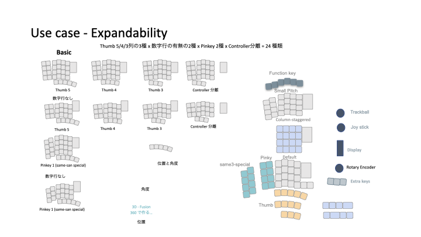

## Pangaea Specification

The Pangaea Specification defines a specification for this changeable and extensible concept, and Reference Implementaion (RI) is an example of an implementation that conforms to the specification. An example of a specification-compliant implementation is the Reference Implementaion (RI), which is the Pangaea keyboard V1.2. In other words, it is possible to implement a keyboard different from the specification-compliant RI 1.2. The advantage of having Pangaea specifications and having each component conform to them is that both RI and other keyboards can use each other's modules simply by connecting them via connectors. The advantage of having Pangaea specifications and having each component conform to them is that both RI and another keyboard can use the module by simply connecting them with a connector.

Here is a list of the customizations that can be done first.
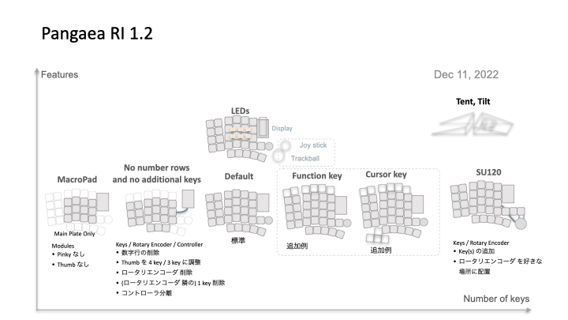

Customization here allows you to, for example, reduce the number of keys in the thumb module, replace the module, or remove some functions. You can replace the pinky module with a Same special, remove the Rotaty Encoder, delete one key, etc.

For those who are not satisfied with just these changes and want to create new components, we will explain them in detail from here.
Specifically, a module that reduces the number of keys in the thumb module, adds a cursor key, and so on. The RI KiCAD thumb module and other design files are distributed under the MIT license, so you can freely develop, distribute, and sell extended parts.

The positioning of each document is shown in the  diagram below.

First, the White Paper, which describes the world we want to realize, introduces the concept of Panagaea. Next, the Use Case section describes what kind of optional components can be created based on the concept.

The Specification section defines the mechanical and electrical signals to maintain backward compatibility between modules and software. The Developer Guide introduces a mechanism to efficiently develop only what is needed while maintaining compatibility.

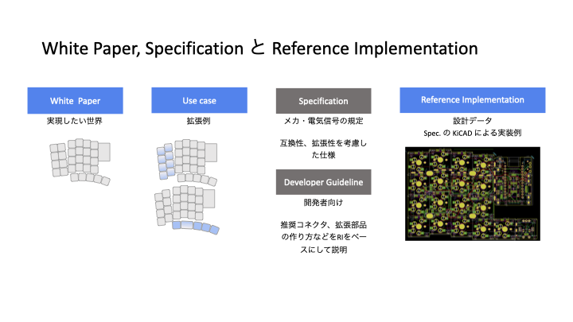

To simplify connection and exchange between modules, SH connectors from JST are used; these connectors are also used in Sparckfun's Qwicc system and cables are available in lengths of 10 cm, 15 cm, 20 cm, etc. In Japan, connectors and cables are available from Akizuki Denshi.

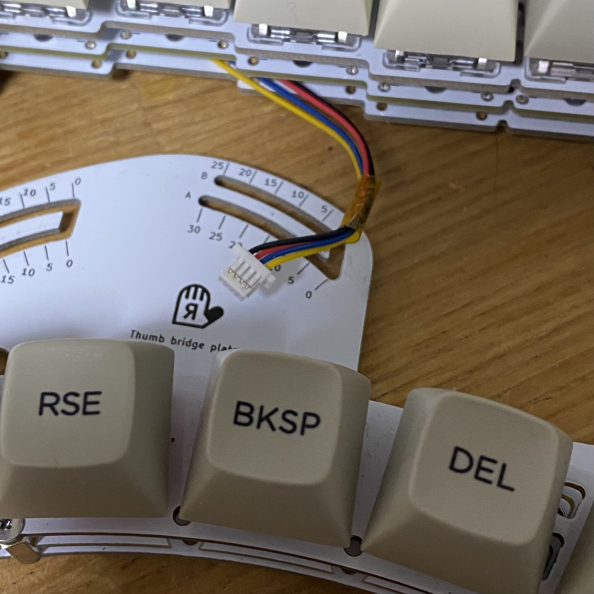

## Examples of what you can do

Various variants can be created, as shown in the diagram.
So you can make certain keys on the thumb bigger, or even lower the outer rows of the little finger module slightly. Alternatively, you can make the pinky keys larger and use the keycaps of a standard keyboard.

You only need to make the parts you want to customise, so you can create a keyboard that is just the way you like it, while saving time and money.

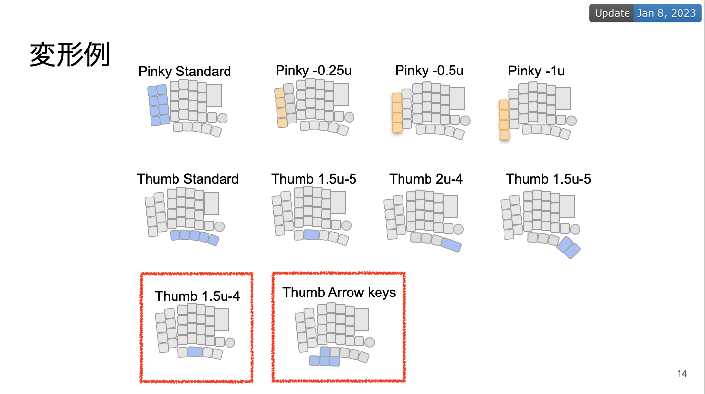

We will now look at the relationship between Pangaea specifications and RI, with some examples.

## Example 1: Create a Thumb module with 4 keys instead of the standard 5 keys

The standard is a row of five 1u-sized keys, which can be reduced to four or even three keys by cutting the PCB. However, standard components are designed to be versatile, so cutting them is not clean and troublesome.

Therefore, here is an example of making a dedicated part with a reduced number of keys from the standard five to four.

So here is an example of making a dedicated component with a reduced number of keys from the standard five to four.

Personally, I would like to have five keys on the left-hand side, but four keys on the right-hand side are sufficient. If I keep the unused five keys, the keys I don't use will bump against my fingers and sometimes feel in the way, so I make one with four keys.

### Overview

The left-hand side of the diagram shows the standard module configuration. On the right of the diagram is the module we are trying to create. Here, the rightmost key is to be deleted.


### Modification Approach

In this case, only one key is deleted, so there is no need to check the specifications as compatibility issues do not arise. Normally, to create a PCB, a circuit diagram is created, footprints are specified according to the components and the components are wired together, but in this case, the circuit diagram and footprints can be omitted because only the components are deleted. The modification proceeds according to the following policy.

- Outline: reuse standard components, create an outer frame with reduced keys and reuse the two screw holes for connecting the modules of the thumb component.
- Wiring: utilise the wiring of the thumb component and delete only at the reduced keys.

The Pangaea specification defines the electrical wiring and logical key layout. The position of the screw holes connecting the modules, indicated by the blue arrows in the diagram, is not specified in the Pangaea specification and is of the size specified for RI 1.2 implementations.
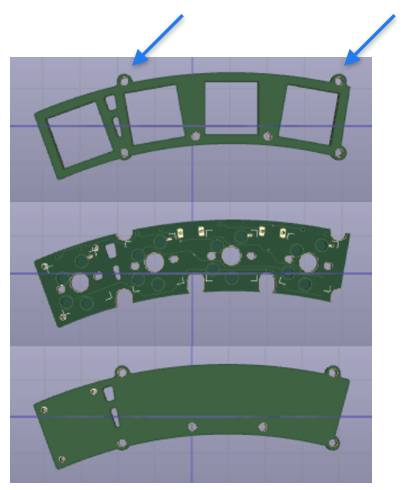

### Modifications in KiCAD

The thumb module needs to be modified in three parts: top plate, PCB and bottom plate. The most efficient order of work is to first determine the external dimensions with the top plate and then modify the PCB and bottom plate accordingly.

Modifying the top plate

1. Delete the footprint of the rightmost key in the KiCAD PCB editor
2. Modify the outline in Layer in Edge Cut to change the design of the outline and resize it to the size of four keys.
3. Delete the wiring associated with the rightmost key

### Ordering PCB

Generate a Gerber file in KiCAD, place an order with the PCB manufacturer and wait for it to arrive. The cost of 5 PCBs can be made inexpensively for a few dollars, including shipping costs.


For example, ask board manufacturing companies such as [Seeed Fusion PCB](https://www.fusionpcb.jp/fusion_pcb.html)

### Assembly

Re-use screws and stand-offs from standard modules for assembly. Connect the completed thumb module to the main module with the SH connector cable to check operation.
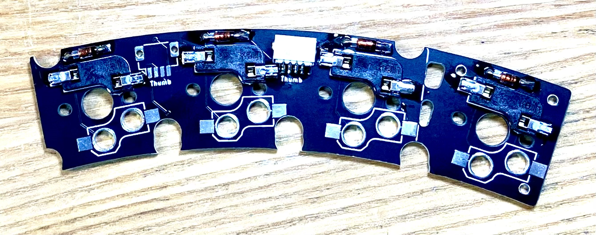
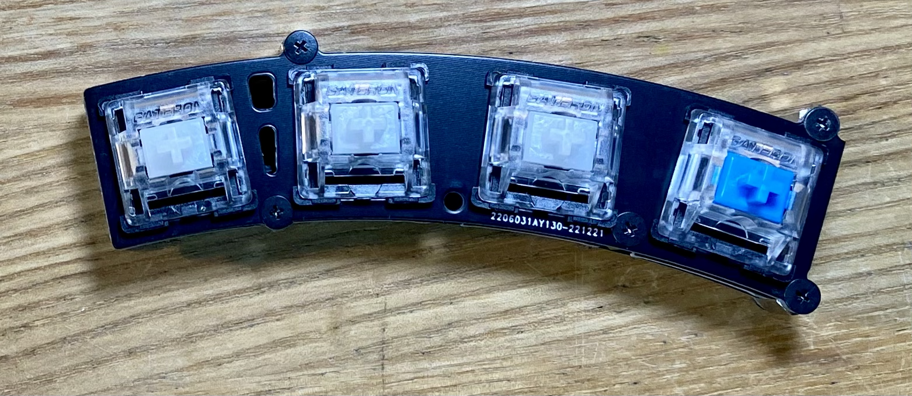

### Software

The diagram shows an example of a QMK assignment, where XXXXXXX and seven consecutive X's indicate that no keys have been assigned. In this example, only one key has been deleted, so no software changes are required, but check carefully where the key has been deleted to make sure it is not out of place.


### Finished

When assembled, it looks like this. In this example, I modified the thumb module by reducing the number of keys by one. You can make it more hand-fit by only making the parts you want to modify in this way. This eliminates the need to cut and process the board and makes it look nicer.

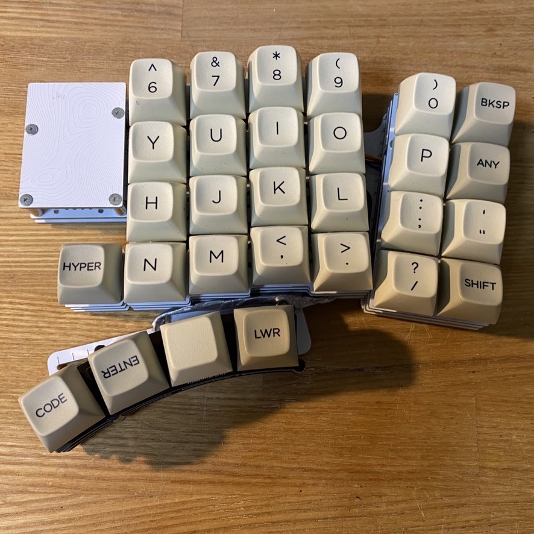

## Example 2: Pinkey module with a slightly lowered row in the little finger section

The diagram below shows an image of the finished module.

### Overview

The height of the outermost row of the pinky is lowered by 0.5u, where 1u is the size of the key. 0.5u means that only half the size of the key is lowered.
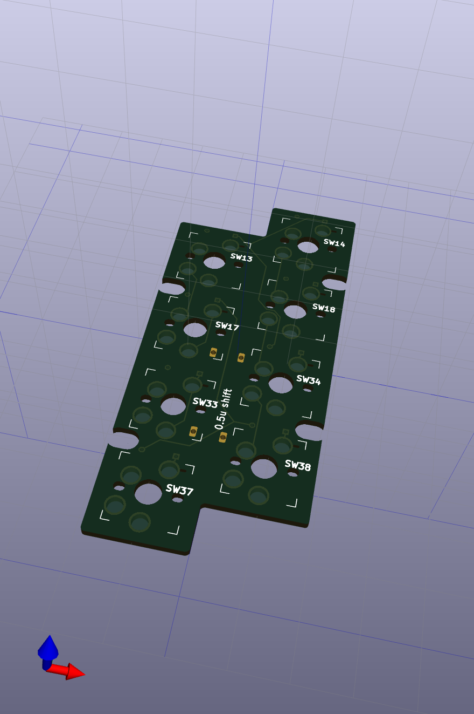

### Modifiation Approach

There are three steps to the modification: place the switches in the desired position on the PCB, prepare the PCB outline and wire it on the PCB.

The difference with Example 1 is that the switches are re-positioned and the wiring has to be redone. Originally, the relevant parts were brought from the schematic for Pinkey in Pangaea RI, but to save time and effort, a Pinkey template was prepared.

### Modification in KiCAD

If the number of switches remains 8, no modification of the schematic is required; proceed to PCB modification.

#### Switch placement: Tips-grid

To ensure a clean vertical and horizontal alignment, it is advisable to set the grids appropriately.

#### Shaping the outline: Tips-Edge cuts

The Grid settings described above are useful for shaping the PCB. To manually fine-tune the outline, place the lines with an eye to the double circles that appear when the lines are overlapped.
It is also recommended to apply DRC to check the outline for errors before proceeding.

#### Wiring: Tips-auto router

The auto router for automatic wiring can be run from the Menu as a KiCAD Plugin. First install freerouter from the Plugin - KiCAD used to have to run it individually from the command line, but in recent versions it is easily available from the menu.

### Ordering PCB

PCBs are small sized boards and can be manufactured inexpensively. You can order from a PCB manufacturing company,
e.g. [Seeed Fusion PCB](https://www.fusionpcb.jp/fusion_pcb.html)

### Assembly

Use standard standoffs and screws.

### Software

No software modifications are required if 8 switches are left in place.

### Finished

You can make your own personalised keyboard to suit your hands by only changing the parts you care about.

## Example 3: Create a Thumb module with additional independent cursor keys

The following is an example of adding cursor keys to the thumb module, rather than cutting keys.
Many of you probably use the QMK's layer functionality to press the keys allocated to up, down, left and right while pressing the keys on the layer. I am the same way. However, it is still advantageous to have independent cursor keys for easier and more relaxed operation.

### Overview

Pangaea can be moved in a circular arc, which means that the position of each module can be adjusted to a certain angle.
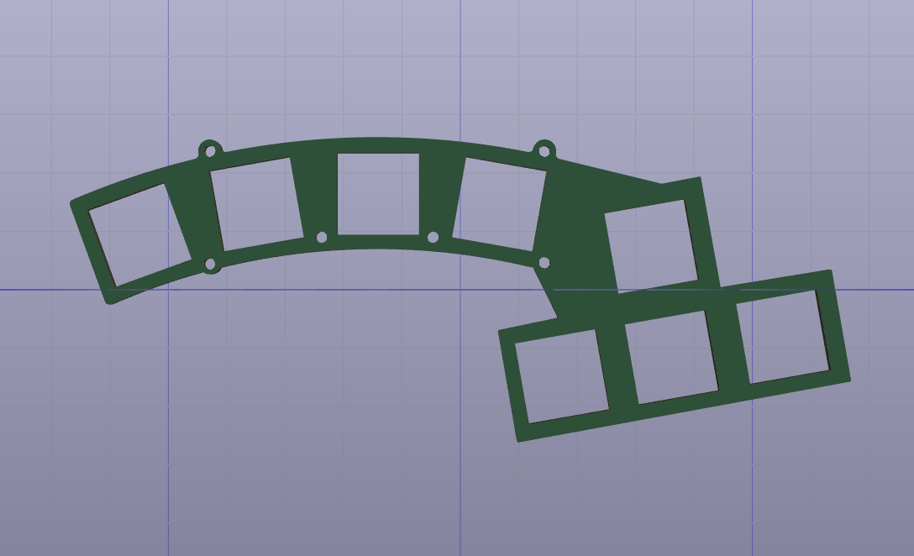

### Modification Approach

The standard thumb module has five keys, but the system actually allows up to eight keys in total to be used. We will use the rightmost key and these three keys to assign a total of four keys to the arrow keys.

### Software

The figure is taken from pangaea.h in the firmware for qmk. Assign the three keys R36, R39 and R40, which are not used as standard, to the arrow keys, as shown in the bottom right-hand corner.

Key assignment
- R35: Up
- R36: Left
- R39: Down
- R40: Right

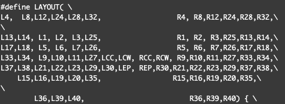

The four key arrangements from the left of the original thumb module: SW15, SW16, SW19 and SW20.
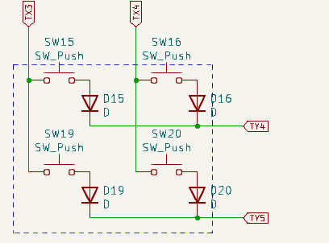

The arrowed part of the addition and the placement of the first key from the right on the original thumb module: SW 35, 36, 39, 40. The two may at first glance appear to be the same schematic, but the diodes are oriented in opposite directions so that each can be determined.


In total, the new thumb module will have the following arrangement.

```text
R15,R16,R19,R20,R35
            R36,R39,R40
```

### Modification in KiCAD

Wire in KiCAD to match the outline from earlier - copy the relevant parts from the Pangaea RI schematic, update the footprint and place them. Copy the outline from the standard Thumb module and add the extensions. Now all that is left is to wire it up using freerouter.

Here you can download KiCAD's Project template to get started right away. In the standard module, two SH connectors are wired together, but you can also just use one. Placing two connectors in a small area may cause the auto router to fail to run.

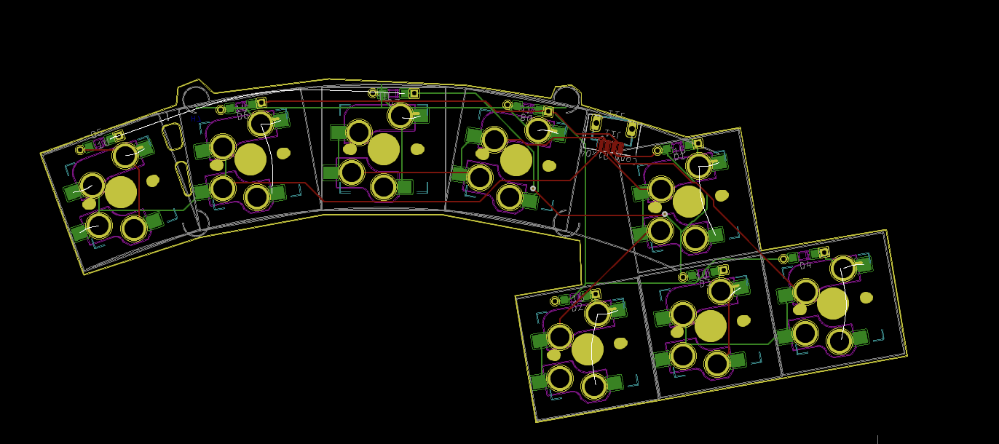
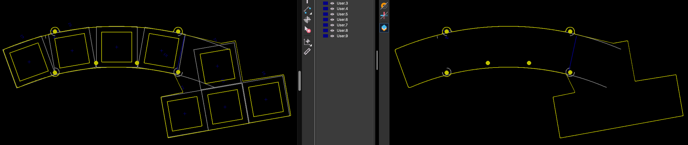

As a recommendation for the order of production, it is recommended to make the PCB first, then copy the outline and make the top plate and bottom plate in that order. You can now make a thumb module to suit your own preferences.

You can increase the size of some keys to 1.5u or 2u, or create your own thumb module. Specifically, you can modify the Lower and Raise keys and the Enter section to use 1.5u sized keys.  In other words, Pangaea is developed with this kind of extension in mind.

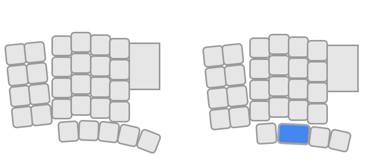

### Ordering PCB

PCBs are small sized boards and can be manufactured inexpensively. You can order from a PCB manufacturing company,
e.g. [Seeed Fusion PCB](https://www.fusionpcb.jp/fusion_pcb.html)

### Assembly

Use the standard stand-offs and screws as they are. The assembly is completed by connecting the SH connector from the main module. Then loosen the screws slightly and adjust the position to fit your own fingers.

### Finished

In this way, with just a few KiCAD operations, you can create your own personalised keyboard tailored to your own hands. This is not just an assembled kit, but a ‘home-made’ keyboard in both name and reality.
