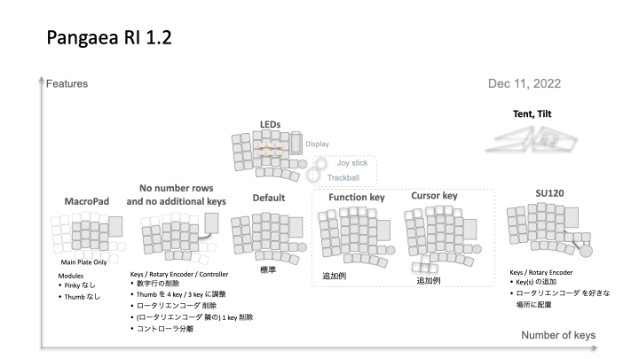
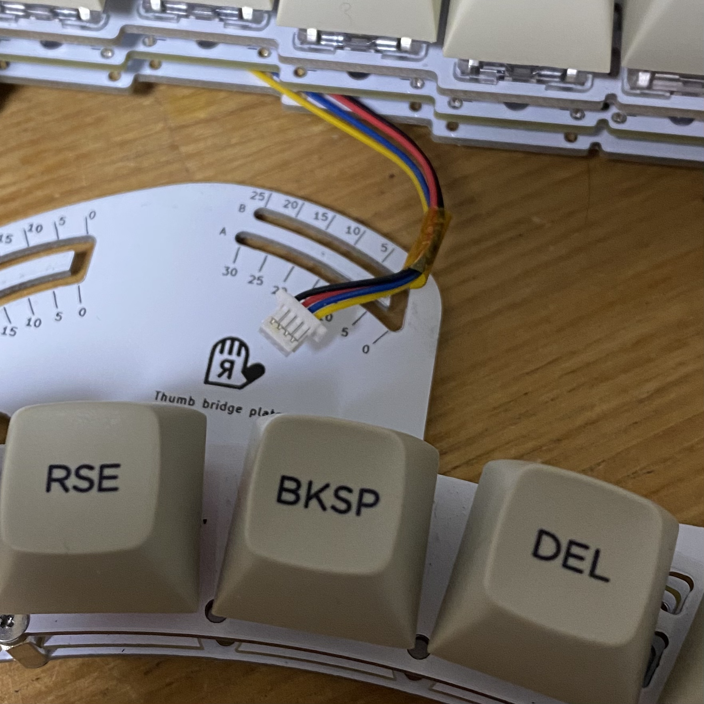
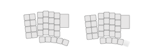
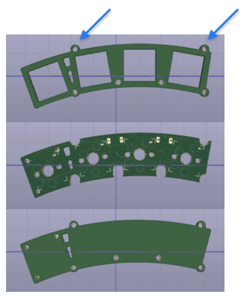
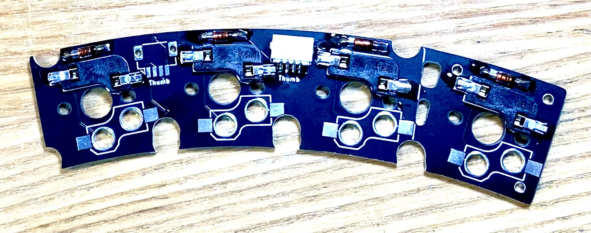
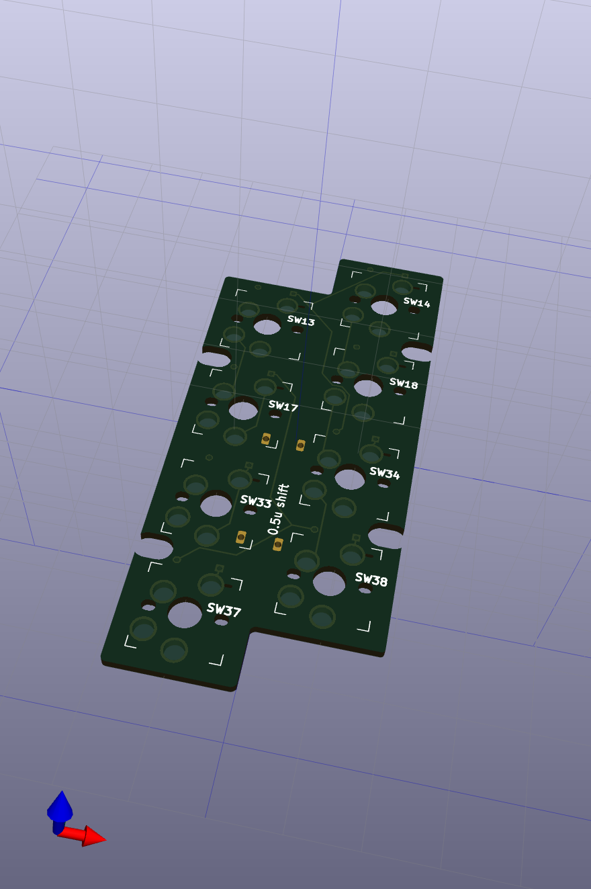

# Pangaea 開発者向けガイド

- [Pangaea 開発者向けガイド](#pangaea-開発者向けガイド-10)
  - [はじめに](#はじめに)
  - [コンセプト](#コンセプト)
  - [どんな変更や拡張をできるようにするのか?](#どんな変更や拡張をできるようにするのか)
  - [コンセプト実現の手段: Pangaea仕様](#コンセプト実現の手段-pangaea仕様)
  - [できることの例](#できることの例)
  - [Example 1： 4キーに減らした Thumb モジュールを作る](#example-1-4キーに減らした-thumb-モジュールを作る)
    - [完成のイメージ](#完成のイメージ)
    - [修正方針](#修正方針)
    - [KiCADでの修正](#kicadでの修正)
    - [PCB発注](#pcb発注)
    - [組み立て](#組み立て)
    - [ソフトウェア](#ソフトウェア)
    - [完成](#完成)
  - [Example 2： 小指部分の列が少し下がった Pinkey module を作る](#example-2-小指部分の列が少し下がった-pinkey-module-を作る)
    - [完成のイメージ](#完成のイメージ-1)
    - [修正方針](#修正方針-1)
    - [修正作業](#修正作業)
    - [PCB発注](#pcb発注-1)
    - [組み立て](#組み立て-1)
    - [ソフトウェア](#ソフトウェア-1)
    - [完成](#完成-1)
  - [Example 3： 独立カーソルキーを足した Thumb モジュールを作る](#example-3-独立カーソルキーを足した-thumb-モジュールを作る)
    - [完成のイメージ](#完成のイメージ-2)
    - [修正方針](#修正方針-2)
    - [ソフトウェア](#ソフトウェア-2)
    - [KiCAD での修正](#kicad-での修正)
    - [PCB発注](#pcb発注-2)
    - [組み立て](#組み立て-2)
    - [完成](#完成-2)

## はじめに

この開発者向けガイドでは Panagea Keyboard の拡張可能な仕組みを利用して自分の好きなように親指や小指のモジュールを作る方法を紹介します。Pangaea Keyboard は、@otahinosameさん、@e3w2qさん、@k2 の3人による共同のProjectです。

標準の親指モジュールでは、5つのキーが用意されており、位置を調整することができるだけではなく、PCB を加工し、キーを削ることでキーを4つや3つのキーににすることができます。とはいってもPCBの加工は面倒ですし加工時の怪我の可能性もありおすすめな方法でもありません。また親指で大きなキーを押したいとか、通常の 1u サイズではなくて、2倍のサイズの 2u を使いたいとか、少し大きい 1.5u サイズのキーを使いたいという要望にはこたえることができません。
そこで、このような要望を実現するために、標準の PCB を修正して拡張モジュールを作ります。好きなように修正できるため、キーサイズの変更、キー数の変更、キー配置の変更など、何でもできることになります。

ことわざで「弘法筆を選ばす」と言われるように書に優れている者なら筆の善し悪しは関係なく、つまり技量が優れていれば道具に左右されないという見方もありますが、そもそも手の大きさや手の動く範囲は人それぞれに異なるので筆一本の世界とは異なると思います。そこで、ここでは道具であるキーボードを修正するアプローチをとります。

## コンセプト

[White Paper](whitepaper_jp.md) で実現したい世界が説明されているように Panagaea Keyboard では、キーの物理的な位置を調整することができるだけではなく、好きな部品を組み合わせて利用することができます。共通部分となるメインモジュールやマイコンの配線を再設計することなく、変更が必要な親指や小指の部分のモジュールのみを設計し、最小の工数で自分好みの keyboard を作ることができるようになっています。あなたが入れ替え可能な拡張モジュールを作り、その設計データを公開することで、誰かのモジュール開発のきっかけになれるかもしれません。

## 具体的にどんなことができるのか?

例えば次のような部品の変更や拡張が考えられます。
まずは標準セットでは、親指モジュールと小指モジュールを省いたメインモジュールだけのマクロパッドも作れます。標準レイアウトからの小さな変更ではロータリエンコーダの省略、ロータリーエンコーダの隣のキーを削除できます。また Joy Stick などの拡張部品も作ることができます。また @e3w2q さんが提供している SU120 を用いてキーの追加なども可能です。SU120はネジ止め用の穴が基板に用意されていますので SU120 のジョイントを用いて好きな位置にキーやロータリーエンコーダを配置することができます。

図に示すように互換性を考慮した作りをすることにより新しい部分に集中できて開発の効率がよくなります。


## Pangaea仕様

この変更や拡張ができるコンセプトを実現するために仕様(Pangaea Specification) が規定されており、仕様に準拠した実装の例として Reference Implementaion (RI) があります。それが Pangaea keyboard V1.2 です。つまり、仕様に準拠した RI 1.2とは別の keyboard の実装もあり得えるわけです。例えば左右を分離しない一体型、カスタマイズした親指モジュールを持つもの、または独自の位置調整用のメカ機構を持ってもよいわけです。Pangaea の仕様を決めてそれぞれの部品がそれに準拠する利点として、RI でも別の keyboard でもコネクタでつなぐだけで相互にモジュールを利用できるわけです。

まずできるカスタマイズの一覧です。



ここでのカスタマイズでは、例えば親指モジュールのキーの数を減らしたり、モジュールを交換したり、一部機能を削除することができます。小指モジュールをSameスペシャルに交換する、Rotaty Encoder を削除する、キーを一つ削除するなどがあります。

各文章の位置づけは次の図のようになります。

まず実現したい世界を描いた White Paper ではPanagaeaのコンセプトを紹介しています。次に Use Case ではコンセプトに沿って具体的にどんなオプションの部品を作ることができるのかをあげています。

仕様(Specification) ではモジュール間の接続とソフトウェアの後方互換性を維持するためにメカや電気信号が規定されています。そして本稿の開発者けガイド(Developer Guide) では互換性を維持しつつ、効率的に必要なところだけを開発できる仕組みをご紹介します。


モジュール間の接続や交換を簡単にするために JST 社の SH コネクタを採用しています。Sparckfun 社の Qwicc システムでも利用されてコネクタであり、10cm, 15cm, 20cmなどの長さのケーブルを入手することができます。日本では秋月電子さんがコネクタやケーブルを取り扱っています。



## できることの例

図に示すようないろいろな変形例を作ることができます。
親指の特定のキーを大きくしたり、小指モジュールの外側の列を少し下げたりもできるわけです。あるいは小指のキーを大きくして、標準キーボードのキーキャップを使うこともできます。
カスタマイズしたい部分だけを作ればよいので、時間やコストを抑えつつ、自分好みのキーボードを作ることができます。


それでは、いくつか例を示しながら、Pangaeaスペック、RIの関係を見ていきます。

## Example 1： 標準の5キーから4キーに数を減らした Thumb モジュールを作る

標準では 1u サイズのキーが5つ並んでおり、PCBを切断すれば4キーあるいは3キーまで数を減らすことができます。しかしながら標準部品は汎用性を持たせて設計しているため、切断すると切り口がきれいに仕上がりませんし、面倒です。

そこで、ここでは専用部品としてキーの数を標準の5つから4つに減らした専用のものを作る例を紹介します。
私個人としては、左側は 5つのキーが欲しいのですが、右側は 4キーで十分です。使わない5キーのままだと利用しないキーが指にぶつかり、邪魔に感じることがありますので 4キーのものを作ります。

### 完成のイメージ

図の左が標準モジュールの構成です。図の右が我々が作ろうとしているモジュールです。ここでは一番右端のキーを削除することにします。


### 修正方針

今回はキー1つ分を削るだけですので互換性の問題も生じないため仕様の確認は不要です。通常、PCBを作るには回路図を作成し部品に応じたフットプリントを指定して部品同士を配線するという流れになりますが、ここでは部品の削除だけなので回路図とフットプリントの部分は省くことができます。修正は次の方針で進めます。

- 外形：標準部品を再利用し、キーを減らした外枠を作り、親指部品のモジュール間をつなぐための2つのねじ穴を再利用する
- 配線：親指部品の配線を利用し、削減したキーのところだけ削除する

Pangaea仕様では電気配線および論理的なキーレイアウトが規定されています。また図の青い矢印で示されたモジュール間を接続するねじ穴の位置は Pangaea仕様では規定されておらず、RI 1.2 の実装として規定されたサイズになっています。


### KiCADでの修正

親指モジュールはトッププレート、PCB、ボトムプレートの3つを修正する必要があります。作業の順番としては、まずトッププレートで外形サイズを決めて、それに合わせてPCBとボトムプレートを修正していくのが効率がよいと思います。

トッププレートの修正
1. KiCAD PCB editor にて一番右端のキーのフットプリントを削除する
2. 外形のデザインを変更するために Edge Cut の Layer にて外形を修正し、サイズをキー4つ分に修正する
3. 一番右のキーに関連する配線を削除する

### PCBの発注

KiCAD で Gerber ファイルを生成し、基板の製造会社に発注し届くのを待ちます。費用は PCB5枚なら配送料を含めて数ドルで安価に作ることができます。

例えば、Seeed Fusion PCB などの基板製造の会社にお願いします。
https://www.fusionpcb.jp/fusion_pcb.html

### 組み立て

標準モジュールのネジやスタンドオフを再利用して組み立てます。完成した親指モジュールとメインモジュールをSHコネクタのケーブルで接続して動作を確認します。



### ソフトウェア

図はQMK の割当の例です。XXXXXXとXが7個連続しているところは何もキーが割り当てられていないということを示します。この例ではキーを一つ削除しただけですのでソフトウェアの変更は不要ですが、削除した場所をよく確認し、ずれていないことを確認します。


### 完成

組み立てるとこのようになりました。この例では親指モジュールのキーの数を１つ減らす修正しました。このように自分が修正したい部分だけを作ればより手に合わせることができるようになります。これで基板を切断する手間がなくなり、見た目もきれいになります。


## Example 2： 小指部分の列が少し下がった Pinkey module を作る

図はできあがりのモジュールのイメージです。

### 完成のイメージ

ここらへんは個人の好みが出てくるとところを思いますが、ここでは小指部分の最も外側の列の高さを0.5uずつ下げています。1uはキーのサイズです。0.5uですから、ちょうどキーのサイズの半分だけが下げることになります。




### 修正方針

修正のステップは、スイッチを好きな位置に配置する、外形を整える、配線をする、の3つです。
例1との違いは、スイッチの配置が変わり、配線がやり直しになることです。Pinkey用の回路図を用意して進めます。本来は、Pangaea RIの回路図から該当部分を持ってくるのですが、手間を省くために Pinkey のテンプレートを用意しました。

### 修正作業

スイッチが8個のままでしたら回路図の修正は不要です。PCBの修正に進みます。

#### スイッチの配置: tips: Grid

縦横きれいに並べるためには、適切にGridを設定するとよいです。

#### 外形を整える: tips: Edge cuts

PCBの外形を整える際には先のGrid設定が有効です。手動で細かく合わせるには、線と線とを重ねたときに位置が重なったときに表示される二重丸を意識して配置します。またDRCをかけて外形にエラーがないか確認しながら進めると確実です。

#### 配線: tips: auto router

KiCADのPluginとしてMenuから実行できるようになっています。まずはfreerouterをインストールします。以前のようにコマンドラインから個別に実行する必要はなく、簡単に利用できるようになっています。

### PCB発注

サイズの小さな基板ですので安価に製造可能です。例えば、Seeed Fusion PCB などの基板製造の会社にお願いします。
https://www.fusionpcb.jp/fusion_pcb.html

### 組み立て

標準のスタンドオフやネジをそのまま使います。

### ソフトウェア

スイッチが8個のままでしたらソフトウェアの修正は不要です。

### 完成

キーボード全体を再設計することなく、自分が気になるところだけを修正することで効率よく自分の手に合わせた自分だけのキーボードができてしまいます。


## Example 3： 独立カーソルキーを足した Thumb モジュールを作る

次はキーを削るのではなくて、親指モジュールにカーソルキーを追加する例を紹介します。
おそらく多くの方は、QMKのレイヤの機能を利用して、レイアのキーを押しながら上下左右に割り振ったキーを押す、という使い方を利用されていると思います。私もそうなのえすが。
しかし、やはりカーソルキーは独立したものがあると操作が簡単になり、かつリラックスして操作できる利点があります。

### 完成のイメージ

図のような完成を目指します。Pangaea では円弧を描くように動かせますので多少の角度ならモジュールごと位置を調整できることになります。


### 修正方針

標準の親指モジュールは5つのキーがありますが、実は合計8個まで利用できる配列になっています。一番右のキーと、この3キーを利用して、合計4キーを矢印キーに割り当てることにします。

### ソフトウェア

図はqmk用のfirmwareのpangaea.hからの抜粋です。右下にあるように標準では利用されていないR36,R39,R40の3つを矢印キーに割り当てます。

キーの割当
* R35: 上
* R36: 左
* R39: 下
* R40: 右


元の親指モジュールの左から4つのキーの配置です。SW15, SW16, SW19, SW20の4つです。


追加分の矢印部分と元の親指モジュールの右から一つ目のキーの配置です。SW35,36,39,40です。この2つは一見すると同じ回路図に見えるかもしれませんが、ダイオードの向きが逆になっていますのでそれぞれを判定することができます。


トータルでは、新規の親指モジュールは下記のような配列になります。

```
R15,R16,R19,R20,R35
            R36,R39,R40
```
### KiCAD での修正

先程の外形に合わせてKiCADで配線していきます。Pangaea RI の回路図から該当部分をコピーしてfootprintを更新し配置します。外形を標準のThumbモジュールからコピーして拡張部分を加えます。あとはfreerouterを用いて配線するだけです。

ここでは、KiCADのProject テンプレート をdownloadすれば、すぐに作業を始められるようになっています。標準モジュールでは2つのSHコネクタが配線されていますが、一つだけにしても大丈夫です。狭い範囲にコネクタを2つ配置すると、auto routerの実行に失敗することもあります。


作る順番としては、まずPCBを作ったら、その外形をcopyして top plate, bottom plateの順に作るとよいと思います。もうこれで自分の好みに合わせたthumb moduleが作れるわけです。

一部のキーサイズを大きくして、1.5u や2uサイズにしたり、独自の Thumb モジュールを作ることができます。具体的にはLower, Raiseの2つのキーとEnter部分に1.5uのサイズのキーを使えるように修正したりできます。このような拡張ができることを想定して開発しています。


### PCB発注

Gerberファイルを生成して発注します。例えば、Seeed Fusion PCB などの基板製造の会社にお願いします。
https://www.fusionpcb.jp/fusion_pcb.html

### 組み立て

標準のスタンドオフやネジをそのまま使います。メインモジュールからのSHコネクタを接続して組み立ては完了です。
ネジを少し緩めて位置を調整します。

### 完成

このように KiCADを少し操作するだけで自分の手に合わせた自分だけのキーボードができてしまいます。これならキットを組み立てただけではなく、名実ともに「自作」キーボードと言えるのではないでしょうか。

